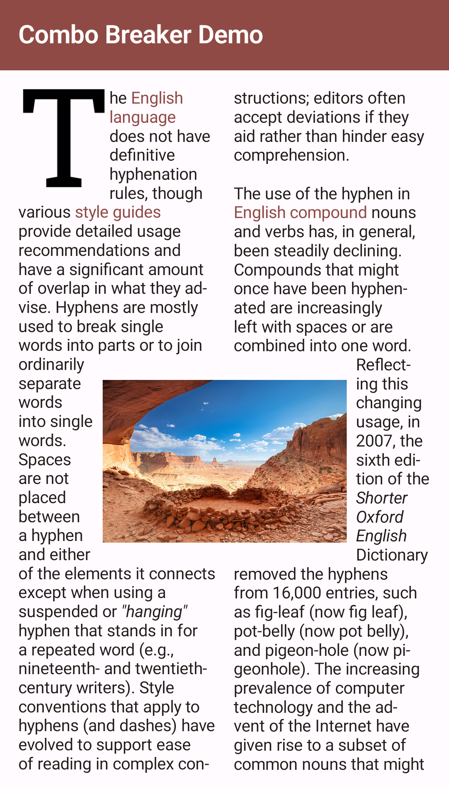
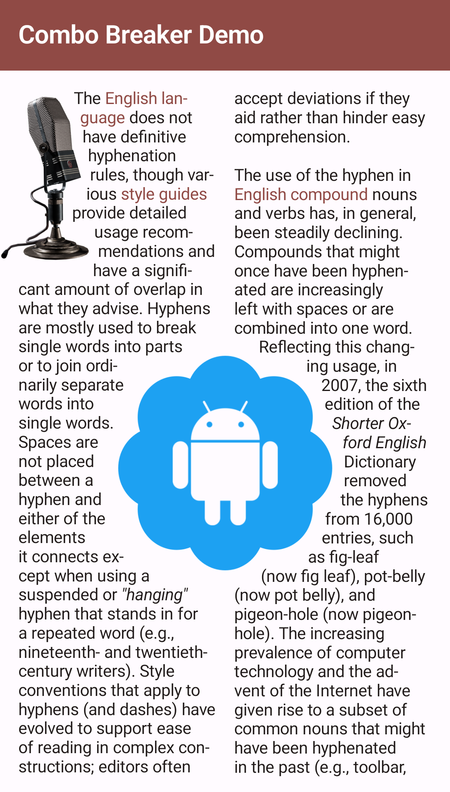
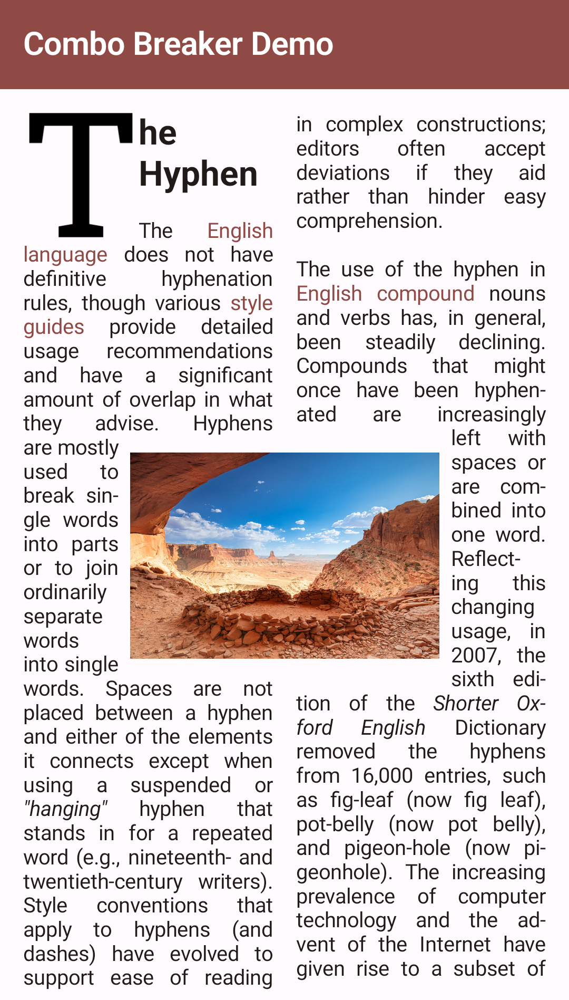
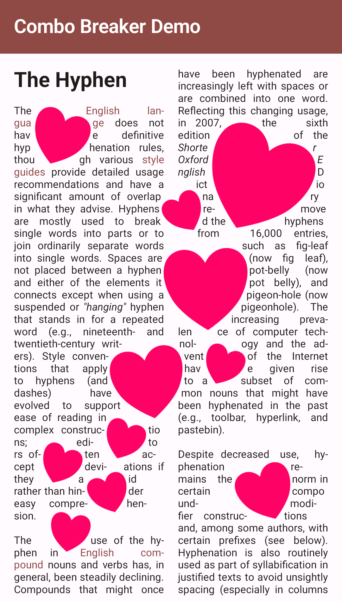

# Combo Breaker

[](https://maven-badges.herokuapp.com/maven-central/dev.romainguy/combo-breaker)
[](https://maven-badges.herokuapp.com/maven-central/dev.romainguy/combo-breaker-material3)
[](https://github.com/romainguy/combo-breaker/actions?query=workflow%3AAndroid)

Composable widget for Jetpack Compose that allows to flow text around arbitrary shapes over
multiple columns. The `TextFlow` composable behaves as a `Box` layout and will automatically
flow the text content around its children.

* [Features](#features)
* [Design Systems](#design-systems)
* [Examples](#examples)
* [Maven](#maven)
* [Roadmap](#roadmap)
* [License](#license)
* [Attribution](#attribution)

## Features

- Multi-column layout
- Styled strings (`AnnotatedString`)
- Default rectangular shapes
- Arbitrary shapes (any `Path`)
- Justification
- Hyphenation
- Generate shapes from images
- Path division (extract multiple contours as a list of paths)
- Compatible with API 29+

## Design Systems

Combo Breaker provides two levels of APIs depending on what design system you use:

- `BasicTextFlow` from the `dev.romainguy:combo-breaker` artifact, which works with any design system
- `TextFlow` from the `dev.romainguy:combo-breaker-material3` artifact, which works with Material3

Choose `BasicTextFlow` if you do not have or do not want a dependency on
`androidx.compose.material3:material3`.

## Examples

The following code defines two images to flow text around:

```kotlin
TextFlow(
    SampleText,
    style = TextStyle(fontSize = 14.sp),
    columns = 2
) {
    Image(
        bitmap = letterT.asImageBitmap(),
        contentDescription = "",
        modifier = Modifier
            .flowShape(FlowType.OutsideEnd)
    )

    Image(
        bitmap = badgeBitmap.asImageBitmap(),
        contentDescription = "",
        modifier = Modifier
            .align(Alignment.Center)
            .flowShape(margin = 6.dp)
    )
}
```



Any child of `TextFlow` allows text to flow around a rectangular shape of the same dimensions of the
child. The `flowShape` modifier is used to control where text flows around the shape (to the
right/end of the T) and around both the left and right sides of the landscape photo (default
behavior). In addition, you can define a margin around the shape.

The `flowShape` modifier also lets you specify a specific shape instead of a default rectangle.
This can be done by passing a `Path` or a lambda that returns a `Path`. The lambda alternative
is useful when you need to create a `Path` based on the dimensions of the `TextFlow` or the
dimensions of its child.

Here is an example of a `TextFlow` using non-rectangular shapes:

```kotlin
val microphoneShape = microphoneBitmap.toContour(alphaThreshold = 0.5f).asComposePath()
val badgeShape = badgeShape.toContour(alphaThreshold = 0.5f).asComposePath()

TextFlow(
    SampleText,
    style = TextStyle(fontSize = 14.sp),
    columns = 2
) {
    Image(
        bitmap = microphoneBitmap.asImageBitmap(),
        contentDescription = "",
        modifier = Modifier
            .offset { Offset(-microphoneBitmap.width / 4.5f, 0.0f).round() }
            .flowShape(FlowType.OutsideEnd, 6.dp, microphoneShape)
    )

    Image(
        bitmap = badgeBitmap.asImageBitmap(),
        contentDescription = "",
        modifier = Modifier
            .align(Alignment.Center)
            .flowShape(FlowType.Outside, 6.dp, badgeShape)
    )
}
```

Using the extension `Bitmap.toContour` provided by this library, a shape can be extracted from a
bitmap and used as the flow shape for the desired child:



`TextFlow` supports multiple text styles and lets you control justification and hyphenation. In
the example below, both justification and hyphenation are enabled:



You can also specify multiple shapes for any given element by using the `flowShapes` modifiers
instead of `flowShape`. `flowShapes` accepts/returns list of paths instead of a single path.
This feature can be used in combination with the supporting API `Path.divide` which divides a
path's contours into a list of individual paths. For instance:

```kotlin
val heartsShapes = heartsBitmap.toContour().asComposePath().divide()

TextFlow(
    SampleText,
    style = TextStyle(fontSize = 12.sp),
    columns = 2
) {
    Image(
        bitmap = heartsBitmap.asImageBitmap(),
        contentDescription = "",
        modifier = Modifier
            .align(Alignment.Center)
            .flowShapes(FlowType.Outside, 4.dp, heartsShapes)
    )
}
```

The division operation create many shapes around which the text can flow:



## Maven

```gradle
repositories {
    // ...
    mavenCentral()
}

dependencies {
    // Use this library and BasicTextFlow() if you don't want a dependency on material3
    implementation 'dev.romainguy:combo-breaker:0.6.0'

    // Use this library and TextFlow() if you use material3
    implementation 'dev.romainguy:combo-breaker-material3:0.6.0'
}
```

## Roadmap

- Backport to earlier API levels.
- Lines containing styles of different line heights can lead to improper flow around certain shapes.
- More comprehensive `TextFlowLayoutResult`.
- Add support to ellipsize the last line when the entire text cannot fit in the layout area.
- Add support for text-relative placement of flow shapes.
- Implement margins support without relying on `Path.op` which can be excessively expensive with
  complex paths.
- BiDi text hasn't been tested yet, and probably doesn't work properly (RTL layouts are however
  supported for the placement of flow shapes and the handling of columns).
- Improve performance of contours extraction from an image (could be multi-threaded for instance).
- Investigate an alternative and simpler way to handle placement around shapes (beam cast instead 
  of the purely geometric approach that currently requires a lot of intersection work).
- Support flowing text inside shapes.

## License

Please see [LICENSE](./LICENSE).

## Attribution

The render of the microphone was made possible thanks to
[RCA 44-BX Microphone](https://skfb.ly/6AKHx) by Tom Seddon, licensed under
[Creative Commons Attribution](http://creativecommons.org/licenses/by/4.0/).

Sample text taken from the [Wikipedia Hyphen article](https://en.wikipedia.org/wiki/Hyphen).
